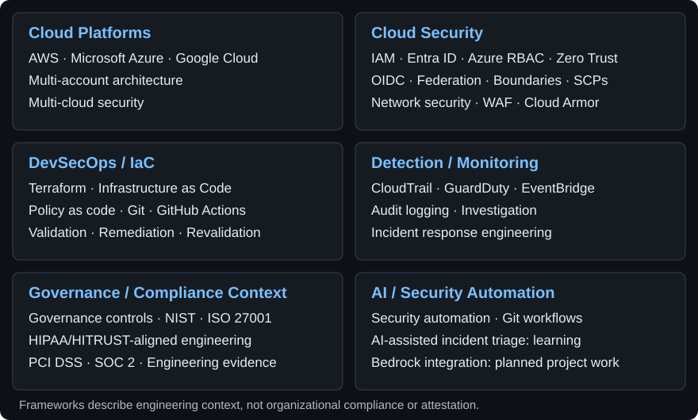
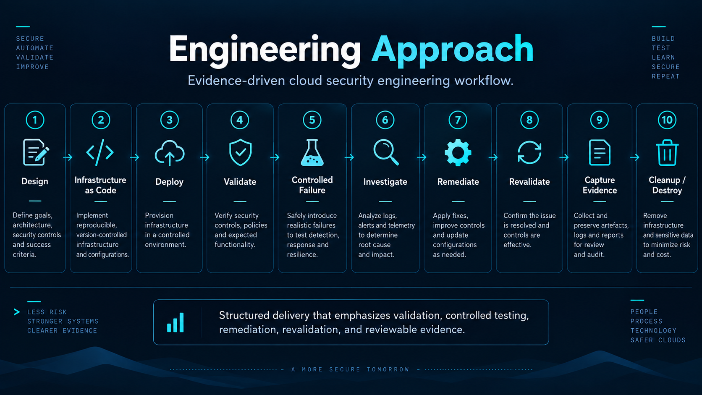
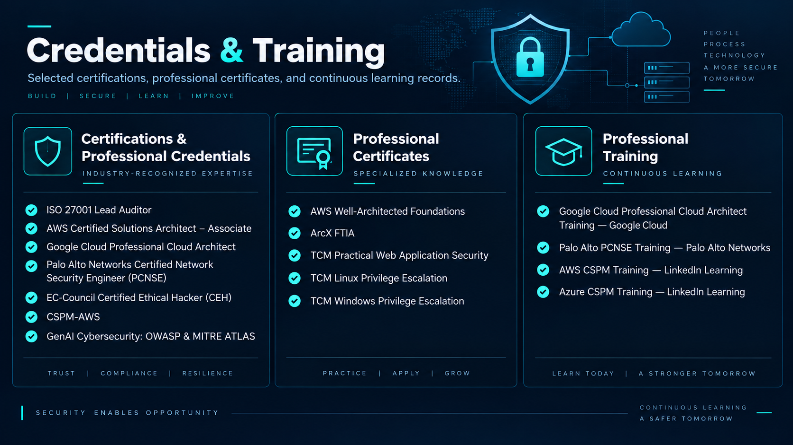

# Surya Naga Sesank M

Cloud Security Engineering | Security Architecture | DevSecOps

Cloud security engineer with 8+ years in cybersecurity, turning security architecture into reviewable engineering outcomes across AWS, Microsoft Azure, and Google Cloud. My work combines Infrastructure as Code, identity and Zero Trust controls, cloud governance, detection, incident response, and security automation, with an emphasis on validation, controlled testing, remediation, and evidence.

[Portfolio](https://nagasesank.github.io/) | [LinkedIn](https://www.linkedin.com/in/suryasesank/) | [Engineering Writing](https://nagasesank.github.io/writing/)

## Security Engineering Focus

- Cloud security architecture across AWS, Microsoft Azure, and Google Cloud
- Terraform, Infrastructure as Code, and Git workflows
- IAM, Microsoft Entra ID, workload identity federation, permission boundaries, SCPs, Azure RBAC, and Zero Trust
- Multi-account / multi-cloud governance, CloudTrail, GuardDuty, EventBridge, and Azure identity controls
- Detection and incident response engineering
- AWS WAF, Google Cloud Armor, Azure security controls, and network security
- DevSecOps, security automation, controlled validation, remediation, revalidation, and engineering evidence
- Framework-aware engineering context: NIST, ISO 27001, HIPAA/HITRUST-aligned engineering, PCI DSS, and SOC 2. These references describe engineering context, not organizational compliance, certification, or attestation.

## Featured Projects by Domain

### AWS

| Project | Case Study | GitHub Repo | What It Does |
| --- | --- | --- | --- |
| AWS Multi-Account Zero-Trust Architecture Lab | [Case Study](https://nagasesank.github.io/projects/aws-zero-trust-org-lab/) | [Repository](https://github.com/nagasesank/aws-zero-trust-org-lab) | Engineers AWS Organizations, SCPs, IAM boundaries, audit logging, GuardDuty, isolation, and policy-as-code validation for a multi-account Zero Trust lab. |
| Enterprise Multi-Cloud WAF Evaluation Platform | [Case Study](https://nagasesank.github.io/projects/multicloud-waf-platform/) | [Repository](https://github.com/nagasesank/multicloud-waf-platform) | Deploys and validates AWS WAF alongside equivalent Google Cloud Armor controls through reusable Terraform and evidence-backed testing. |
| HIPAA/HITRUST-Aligned Healthcare Security Engineering Platform | [Case Study](https://nagasesank.github.io/projects/hipaa-hitrust-healthcare-security/) | [Repository](https://github.com/nagasesank/hipaa-hitrust-healthcare-security-project) | Implements AWS-first segmentation, least privilege, logging, controlled validation, remediation, and teardown for a synthetic healthcare workload. |

### GCP

**Under Process**

| Project | Case Study | GitHub Repo | What It Does |
| --- | --- | --- | --- |

### Azure

| Project | Case Study | GitHub Repo | What It Does |
| --- | --- | --- | --- |
| AZ-01 — Azure Workload Identity Attack & Secretless Federation Lab | [Case Study](https://nagasesank.github.io/projects/az-01-azure-workload-identity-security/) | [Repository](https://github.com/nagasesank/AZ-01-azure-workload-identity-security-lab) | Validates a bounded Microsoft Entra workload-identity attack path and remediates credential and authorization risk with GitHub OIDC federation and least-privilege Azure RBAC. |
| AZ-02 — Azure Cloud Security Architecture Review & Controlled Remediation Lab | [Case Study](https://nagasesank.github.io/projects/az-02-azure-enterprise-security-architecture/) | [Repository](https://github.com/nagasesank/AZ-02-azure-enterprise-security-architecture) | Assesses Azure governance, identity, private access, logging, and workload controls through controlled remediation, revalidation, and residual-risk review. |

### AI / Security Automation

| Project | Case Study | GitHub Repo | What It Does |
| --- | --- | --- | --- |
| AI-Powered Polycloud Security Incident Response Platform | [Case Study](https://nagasesank.github.io/projects/ai-powered-polycloud-incident-response/) | [Repository](https://github.com/nagasesank/AI-Powered-Polycloud-Security-Incident-Response-Platform) | Builds an AWS-first event-driven incident-response architecture; Terraform implementation is in progress and Amazon Bedrock integration and attack simulation remain planned. |

## Currently Learning

- AWS advanced networking architecture: hybrid connectivity, Transit Gateway, Route 53, Direct Connect, VPN, VPC design, routing, network security, and troubleshooting
- Advanced AWS Organizations, IAM, SCP, Zero Trust, and policy-as-code patterns
- Microsoft Azure security engineering: Entra workload identities, OIDC federation, Azure RBAC, Terraform, and identity attack-path validation
- AI-assisted cloud security incident triage and response automation
- PMP domains: people, process, business environment, delivery, risk, stakeholder management, and agile/hybrid practices

## Certifications in Progress

- AWS Certified Advanced Networking – Specialty
- Project Management Professional (PMP)

## Cloud Security Capability Stack

Capability areas reflected in the engineering work and learning focus above.

Text summary: AWS / Azure / GCP · Identity, Zero Trust, and network security · Terraform and policy as code · Logging and investigation · Governance and framework alignment · Security automation (AI-assisted triage: learning).

## Engineering Approach

## Credentials & Training

[View supporting certification, certificate, and training records in the portfolio](https://nagasesank.github.io/certifications/)

## Security Labs & Writing

[Friday Security Projects](https://nagasesank.github.io/#security-labs) is a seven-part hands-on security engineering series. The [writing hub](https://nagasesank.github.io/writing/) centralizes public work across [Hashnode](https://hashnode.com/@nagasesank), [Medium](https://sesanknagamunukutla.medium.com/), [DEV](https://dev.to/sesank_naga_m_01), and [LinkedIn](https://www.linkedin.com/in/suryasesank/).

## Connect

[Portfolio](https://nagasesank.github.io/) · [LinkedIn](https://www.linkedin.com/in/suryasesank/) · [GitHub](https://github.com/nagasesank)
